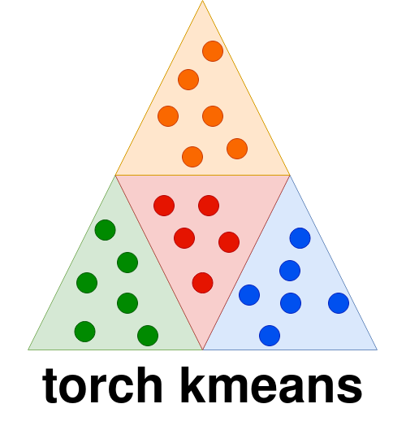

.. badges

    .. image:: https://api.cirrus-ci.com/github/<USER>/torch_kmeans.svg?branch=main
        :alt: Built Status
        :target: https://cirrus-ci.com/github/<USER>/torch_kmeans
    .. image:: https://readthedocs.org/projects/torch_kmeans/badge/?version=latest
        :alt: ReadTheDocs
        :target: https://torch_kmeans.readthedocs.io/en/stable/
    .. image:: https://img.shields.io/coveralls/github/<USER>/torch_kmeans/main.svg
        :alt: Coveralls
        :target: https://coveralls.io/r/<USER>/torch_kmeans
    .. image:: https://img.shields.io/pypi/v/torch_kmeans.svg
        :alt: PyPI-Server
        :target: https://pypi.org/project/torch_kmeans/
    .. image:: https://img.shields.io/conda/vn/conda-forge/torch_kmeans.svg
        :alt: Conda-Forge
        :target: https://anaconda.org/conda-forge/torch_kmeans
    .. image:: https://pepy.tech/badge/torch_kmeans/month
        :alt: Monthly Downloads
        :target: https://pepy.tech/project/torch_kmeans
    .. image:: https://img.shields.io/twitter/url/http/shields.io.svg?style=social&label=Twitter
        :alt: Twitter
        :target: https://twitter.com/torch_kmeans

   .. image:: https://coveralls.io/repos/github/jokofa/torch_kmeans/badge.svg?branch=master
      :alt: Coveralls
      :target: https://coveralls.io/github/jokofa/torch_kmeans?branch=master

|

============
torch_kmeans
============

   PyTorch implementations of KMeans, Soft-KMeans and Constrained-KMeans

torch_kmeans features implementations of the well known k-means algorithm
as well as its soft and constrained variants.

All algorithms are completely implemented as `PyTorch <https://pytorch.org/>`_ modules
and can be easily incorporated in a PyTorch pipeline or model.
Therefore, they support execution on GPU as well as working on (mini-)batches of data.
Moreover, they also provide a `scikit-learn <https://scikit-learn.org/>`_ style interface featuring

.. code-block:: python

   model.fit(), model.predict() and model.fit_predict()

functions.

-> `view official documentation <https://torch-kmeans.readthedocs.io/en/latest/>`_

Highlights
===========
- Fully implemented in PyTorch.
- GPU support like native PyTorch.
- PyTorch script JIT compiled for most performance sensitive parts.
- Works with mini-batches of samples:
   - each instance can have a different number of clusters.
- Constrained Kmeans works with cluster constraints like:
   - a max number of samples per cluster or,
   - a maximum weight per cluster, where each sample has an associated weight.
- SoftKMeans is a fully differentiable clustering procedure and
  can readily be used in a PyTorch neural network model which requires backpropagation.
- Unit tested against the scikit-learn KMeans implementation.
- GPU execution enables very fast computation even for
  large batch size or very high dimensional feature spaces
  (see `speed comparison <https://github.com/jokofa/torch_kmeans/tree/master/examples/notebooks/speed_comparison.ipynb>`_)

Installation
=============

Simply install from PyPI

.. code-block:: console

   pip install torch-kmeans

Usage
============
Pytorch style usage

.. code-block:: python

   import torch
   from torch_kmeans import KMeans

   model = KMeans(n_clusters=4)

   x = torch.randn((4, 20, 2))   # (BS, N, D)
   result = model(x)
   print(result.labels)

Scikit-learn style usage

.. code-block:: python

   import torch
   from torch_kmeans import KMeans

   model = KMeans(n_clusters=4)

   x = torch.randn((4, 20, 2))   # (BS, N, D)
   model = model.fit(x)
   labels = model.predict(x)
   print(labels)

or

.. code-block:: python

   import torch
   from torch_kmeans import KMeans

   model = KMeans(n_clusters=4)

   x = torch.randn((4, 20, 2))   # (BS, N, D)
   labels = model.fit_predict(x)
   print(labels)

Examples
============
You can find more examples and usage in the
`detailed example notebooks <https://github.com/jokofa/torch_kmeans/tree/master/examples>`_.
